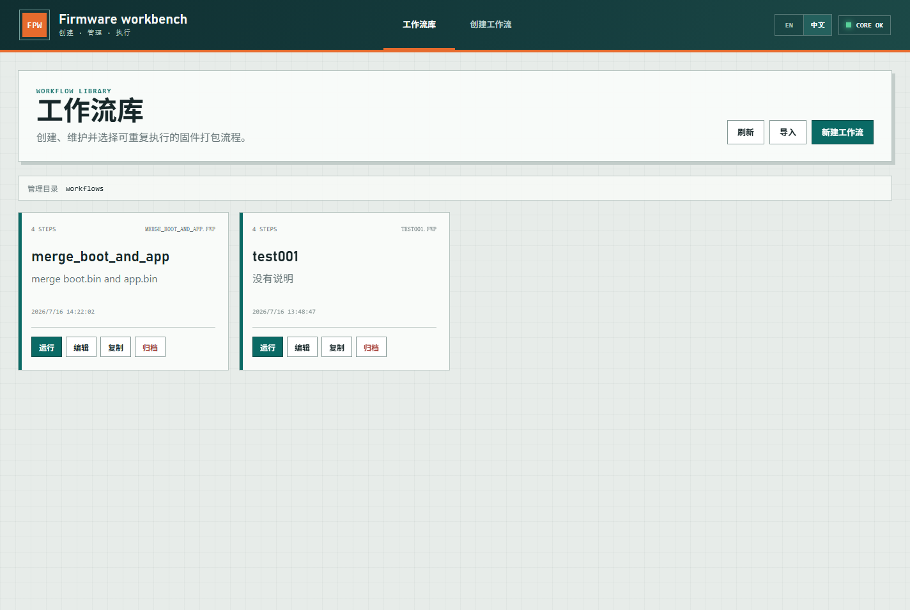
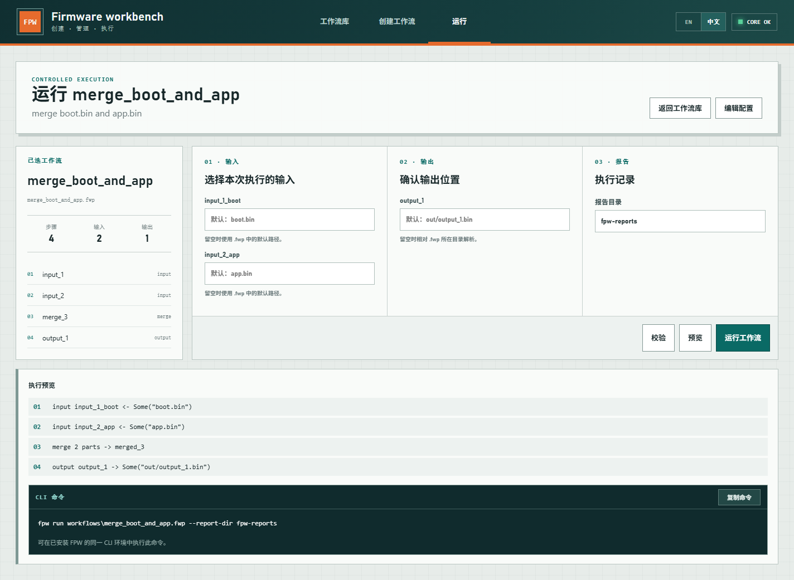

# FPW - 固件打包工作流

[English](README.md) | [User Manual](User-Manual.md) | [中文用户手册](User-Manual-CN.md) | [FWP Schema](docs/fwp-schema-v1.md)

FPW 是一个本地优先的固件打包工作流工具，用于可重复地处理原始二进制固件镜像。

当前版本：**v1.0.3**

Release 下载：[FPW 发布包](https://lite.box.com/s/03t30uatz10t4v3vc5l27nek4db3pgi3)

- `fpw` 是主要的命令行执行器。
- `fpw web` 启动本地 WebUI，用于创建、管理、预览和执行工作流。
- `.fwp` 是可纳入版本管理的 JSON 工作流文件，不依赖 WebUI 也能执行。
- 目标平台为 Windows 和 Linux。

## 主要功能

- 按数组顺序执行 `input`、`output`、`fill`、`delete`、`insert`、`merge`、`crc32` 和 `sha256` 步骤。
- 支持保留绝对地址的 Intel HEX 输入、提取、叠加、补丁、HEX 输出和指定范围 BIN 转换。
- WebUI 提供可见的 Postbuild MCU/DSP 模板入口及 Image/Postbuild 操作表单。
- 支持解析 NVR XLSX/XLSM、修改寄存器数据、注入双 Bank 镜像，并通过 `imgAr.exe` 追加 `NVR-REG` 升级条目。
- 生成 JSON/TXT 执行报告，记录命令、耗时、步骤状态和文件哈希。
- WebUI 提供五阶段创建向导和工作流文件库。
- 支持创建、打开、保存、复制、归档和导入工作流。
- WebUI 支持英文和简体中文，首次使用默认英文。
- Run Preview 同时显示执行预览和可复制的 CLI 命令。


## Windows 快速开始

需要安装：

- Rust 工具链和 Cargo
- Node.js 和 npm

在仓库根目录构建 WebUI 和 Release 可执行文件：

```powershell
Set-Location web
npm install
npm run build
Set-Location ..
cargo build --release -p fpw-cli
```

校验、预览并执行示例：

```powershell
.\target\release\fpw.exe validate examples\fill-crc-sha.fwp
.\target\release\fpw.exe preview examples\fill-crc-sha.fwp
.\target\release\fpw.exe run examples\fill-crc-sha.fwp
```

启动 WebUI：

```powershell
.\target\release\fpw.exe web --host 127.0.0.1 --port 4769
```

浏览器访问 `http://127.0.0.1:4769/`。使用 WebUI 期间需要保持启动终端运行。

可在另一个终端停止或重启已登记的 WebUI 服务：

```powershell
.\target\release\fpw.exe web stop
.\target\release\fpw.exe web restart
.\target\release\fpw.exe web restart --host 127.0.0.1 --port 4769
```

`restart` 默认复用上一次记录的 host 和 port，也可以显式覆盖。

### 自动生成发布包

```powershell
.\scripts\package-release.ps1
```

脚本自动读取项目版本、构建 WebUI 和 Release CLI，并生成 `release\FPW-v1.0.3.zip`。使用 `-SkipBuild` 可以基于已有的 `target\release\fpw.exe` 和 `web\dist` 快速重新打包。

## CLI 命令

```text
fpw validate <workflow.fwp>
fpw preview <workflow.fwp>
fpw run <workflow.fwp> [--input name=path] [--output name=path] [--report-dir path]
fpw config [--output workflow.fwp]
fpw web [--host 127.0.0.1] [--port 4769]
fpw web stop
fpw web restart [--host 127.0.0.1] [--port 4769]
fpw recent list
fpw recent add <workflow.fwp>
fpw image inspect <firmware.hex>
fpw image to-bin <firmware.hex> <firmware.bin> --address <address> --length <length> [--fill <byte>]
```

Intel HEX 检查会保留绝对地址和启动地址。转换 BIN 时必须明确指定地址范围，从而以确定的方式填充稀疏空洞：

```powershell
.\target\release\fpw.exe image inspect .\firmware.hex
.\target\release\fpw.exe image to-bin .\firmware.hex .\firmware.bin `
  --address 0x08000000 --length 0x200000 --fill 0xFF
```

可以重复使用 `--input` 和 `--output` 覆盖工作流中同名的输入输出路径：

```powershell
.\target\release\fpw.exe run workflows\release.fwp `
  --input firmware=C:\firmware\app.bin `
  --output image=C:\firmware\release.bin `
  --report-dir C:\firmware\reports
```

工作流内部声明的相对路径以 `.fwp` 文件所在目录为基准。CLI 的输入输出覆盖路径以及报告目录，如果使用相对路径，则以当前进程目录为基准。

运行 Postbuild MCU 合并基线工作流：

```powershell
.\target\release\fpw.exe validate examples\postbuild-mcu-merge.fwp
.\target\release\fpw.exe run examples\postbuild-mcu-merge.fwp `
  --input gboot=C:\firmware\GungnirS_gboot.hex `
  --input image_a=C:\firmware\GungnirS_imageA.hex `
  --input image_b=C:\firmware\GungnirS_imageB.hex
```

生成 MCU HEX 后注入 DSP BIN：

```powershell
.\target\release\fpw.exe run examples\postbuild-dsp-inject.fwp `
  --input dsp=C:\firmware\dsp_vE000F200.bin
```

DSP 输入最大为 `0x93000` 字节，并按照旧 Postbuild 的 P1/P2 Flash 地址进行分段写入。

## WebUI 使用流程



WebUI 将操作划分为三个任务区域：

1. 在工作流文件库中管理 `.fwp` 文件。
2. 通过五阶段向导创建或编辑工作流。
3. 选择已保存的工作流，预览并执行。

Run Preview 会生成与当前工作流和路径覆盖一致的 `fpw run` 命令。可以复制到另一个已安装 FPW 的终端执行。如果 `fpw` 不在 `PATH` 中，将命令开头替换为 `.\target\release\fpw.exe`。



WebUI 默认把受管工作流保存在 `workflows/`。归档操作会将文件移动到 `workflows/.trash/`，不会永久删除。

环境变量：

- `FPW_WORKFLOW_HOME`：覆盖 WebUI 工作流文件库目录。
- `FPW_CONFIG_HOME`：覆盖最近项目等本地状态的保存目录。

## 执行报告

每次成功执行 `fpw run` 都会生成 JSON 和 TXT 报告，默认写入当前进程目录下的 `fpw-reports/`。

报告包含：

- FPW 版本和工作流标识
- 工作流 SHA256
- 可复现的命令参数
- 开始时间、结束时间和执行耗时
- 每个步骤的状态和错误
- 输入输出文件大小和 SHA256

## 仓库结构

```text
crates/fpw-core/   工作流模型、校验、执行和报告
crates/fpw-cli/    CLI 和本地 Web 服务
web/               React/Vite WebUI
docs/              Schema 和架构文档
examples/          示例工作流和二进制输入
workflows/         WebUI 默认管理的工作流文件库
```
