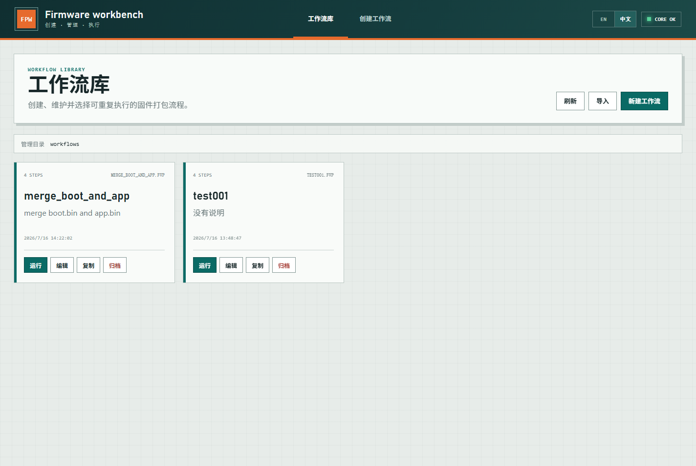
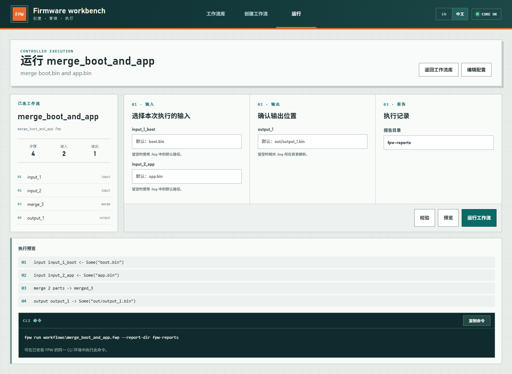

Exit code: 0
Wall time: 2.4 seconds
Output:
# FPW 用户手册

[项目说明](README-CN.md) | [English User Manual](User-Manual.md) | [FWP Schema](docs/fwp-schema-v1.md)

本文介绍 FPW 在 Windows 下的构建方法、CLI/WebUI 使用方式、路径规则，以及常用二进制处理步骤的简单用例。

本文档对应版本：**v0.0.2**

## 1. 构建与启动

### 1.1 环境要求

- Windows PowerShell
- Rust 工具链和 Cargo
- Node.js 和 npm

检查工具链：

```powershell
rustc --version
cargo --version
node --version
npm --version
```

### 1.2 构建 WebUI

```powershell
Set-Location web
npm install
npm run build
Set-Location ..
```

生成的静态页面位于 `web/dist/`。`fpw web` 会直接提供这里的页面资源；如果目录不存在，则只能显示内置回退页面。

### 1.3 构建 CLI

开发构建：

```powershell
cargo build -p fpw-cli
```

Release 构建：

```powershell
cargo build --release -p fpw-cli
```

Release 可执行文件为：

```text
target\release\fpw.exe
```

### 1.4 自动打包 Release

```powershell
.\scripts\package-release.ps1
```

脚本会从 `Cargo.toml` 读取版本号，构建 WebUI 和独立的 Release CLI，然后生成：

```text
release\FPW-v0.0.2\
release\FPW-v0.0.2.zip
```

如果已经完成构建，可跳过重复构建：

```powershell
.\scripts\package-release.ps1 -SkipBuild
```

## 2. `.fwp` 基本结构

`.fwp` 是 JSON 文件。步骤按照 `steps` 数组顺序执行，每个步骤通过 artifact 名称传递内存中的二进制数据。

```json
{
  "schemaVersion": 1,
  "name": "copy-image",
  "description": "Read one image and write it to another path",
  "steps": [
    {
      "id": "firmware",
      "kind": "input",
      "name": "firmware",
      "path": "input.bin"
    },
    {
      "id": "write_image",
      "kind": "output",
      "input": "firmware",
      "name": "image",
      "path": "out/image.bin"
    }
  ]
}
```

关键概念：

- `id`：步骤的唯一标识。
- `name`：可被 CLI `--input` 或 `--output` 覆盖的外部文件名称。
- artifact：步骤之间传递的内存二进制对象，例如 `firmware`、`merged`、`image`。
- `input`、`base`、`insert`：引用前面步骤已经产生的 artifact。
- `output`：当前处理步骤产生的新 artifact 名称；在 `output` 文件步骤中，`input` 才是要写出的 artifact。

数字字段可以使用十进制数或十六进制字符串，例如 `128` 或 `"0x80"`。

## 3. CLI 用法

以下示例假设当前目录是仓库根目录。若已将 `fpw.exe` 加入 `PATH`，可用 `fpw` 替代 `.\target\release\fpw.exe`。

### 3.1 创建基础配置

```powershell
.\target\release\fpw.exe config --output workflows\my-workflow.fwp
```

不提供 `--output` 时，CLI 会交互式询问输出路径。

### 3.2 校验工作流

```powershell
.\target\release\fpw.exe validate workflows\my-workflow.fwp
```

校验会检查 Schema、步骤 ID、artifact 引用和字段有效性，但不会执行文件写入。

### 3.3 预览执行步骤

```powershell
.\target\release\fpw.exe preview examples\merge-insert.fwp
```

Preview 只输出计划执行的步骤，不读取或修改固件文件。

### 3.4 执行工作流

```powershell
.\target\release\fpw.exe run examples\merge-insert.fwp
```

覆盖输入、输出和报告目录：

```powershell
.\target\release\fpw.exe run workflows\release.fwp `
  --input boot=C:\images\boot.bin `
  --input app=C:\images\app.bin `
  --output image=C:\images\combined.bin `
  --report-dir C:\images\reports
```

同一个命令可以多次提供 `--input` 和 `--output`，格式必须是 `name=path`。其中 `name` 对应 `.fwp` 中 `input/output` 文件步骤的 `name` 字段。

### 3.5 导入 `.ffc`

```powershell
.\target\release\fpw.exe import-ffc examples\firmwareflow-basic.ffc `
  --output workflows\imported.fwp
```

导入属于尽力转换。遇到当前版本不支持或不能完整表达的 FirmwareFlow 步骤时，CLI 会输出 warning，应在执行前检查生成的 `.fwp`。

### 3.6 最近项目

```powershell
.\target\release\fpw.exe recent list
.\target\release\fpw.exe recent add workflows\my-workflow.fwp
```

## 4. WebUI 用法

### 4.1 启动服务

```powershell
.\target\release\fpw.exe web --host 127.0.0.1 --port 4769
```

访问 `http://127.0.0.1:4769/`。这是本机服务，关闭启动终端或结束 `fpw.exe` 后页面将无法继续调用执行引擎。

在另一个终端停止或重启已登记的服务：

```powershell
.\target\release\fpw.exe web stop
.\target\release\fpw.exe web restart
.\target\release\fpw.exe web restart --host 127.0.0.1 --port 4769
```

FPW 会在本地配置目录记录活动 WebUI 的 PID、host、port 和版本。`restart` 默认复用已记录的地址，也可以显式覆盖。若记录已经过期，命令只清理记录，不会终止不相关进程。

### 4.2 工作流文件库

WebUI 默认管理仓库下的 `workflows/`：



- Create：创建新工作流。
- Open/Edit：打开并编辑已有工作流。
- Duplicate：复制工作流。
- Archive：移动到 `workflows/.trash/`。
- Import FWP：导入已有 `.fwp`。
- Import FFC：转换并导入 `.ffc`。

设置 `FPW_WORKFLOW_HOME` 后可以使用其他受控目录：

```powershell
$env:FPW_WORKFLOW_HOME='C:\fpw-workflows'
.\target\release\fpw.exe web
```

### 4.3 五阶段创建向导

1. 填写工作流名称、描述和保存路径。
2. 定义一个或多个输入文件。
3. 按顺序添加 `fill`、`insert`、`merge`、`crc32` 或 `sha256` 处理步骤。
4. 定义要写出的 artifact、输出名称和默认路径。
5. 校验、预览并保存工作流；高级模式可直接检查 JSON。

### 4.4 Run 和 Preview

在 Run 页面选择已保存的工作流，然后配置输入、输出和报告目录：



- Validate：检查当前工作流是否合法。
- Preview：显示 Execution preview 和可复制的 CLI command，不执行文件处理。
- Run：调用与 CLI 相同的核心引擎执行，并显示步骤状态和报告路径。

Preview 中的 CLI 命令使用受管工作流的绝对路径，并包含当前填写的非空输入/输出覆盖和报告目录。如果命令以 `fpw` 开头但程序不在 `PATH` 中，将开头替换为 `.\target\release\fpw.exe`。

## 5. 路径规则

- `.fwp` 内部的相对输入输出路径以该 `.fwp` 文件所在目录为基准。
- CLI `--input`、`--output` 中的相对覆盖路径以启动 FPW 时的当前目录为基准。
- `--report-dir` 的相对路径也以当前目录为基准。
- WebUI 中填写的路径由运行 `fpw web` 的服务进程访问，不是由浏览器读取。
- Windows 路径包含空格时应加双引号；WebUI Preview 会自动处理常见的空格路径。

## 6. 用例一：Insert 覆盖写入

`insert` 将一个 artifact 的全部字节覆盖到 `base` artifact 的指定偏移，不会把原数据向后移动。

创建 `workflows/insert-example.fwp`：

```json
{
  "schemaVersion": 1,
  "name": "insert-example",
  "steps": [
    {
      "id": "base_file",
      "kind": "input",
      "name": "base",
      "path": "base.bin"
    },
    {
      "id": "patch_file",
      "kind": "input",
      "name": "patch",
      "path": "patch.bin"
    },
    {
      "id": "insert_patch",
      "kind": "insert",
      "base": "base",
      "insert": "patch",
      "output": "patched",
      "offset": "0x10"
    },
    {
      "id": "write_patched",
      "kind": "output",
      "input": "patched",
      "name": "image",
      "path": "out/patched.bin"
    }
  ]
}
```

执行：

```powershell
.\target\release\fpw.exe run workflows\insert-example.fwp `
  --input base=C:\images\base.bin `
  --input patch=C:\images\patch.bin `
  --output image=C:\images\patched.bin
```

结果语义：

- 从 `base` 的偏移 `0x10` 开始写入 `patch`。
- 被覆盖区域原有字节会被替换。
- 如果写入超过文件末尾，输出会扩展。
- 偏移与原文件末尾之间的空洞使用 `0xFF` 填充。

## 7. 用例二：Merge 合并镜像

`merge` 把多个 artifact 放到一个新镜像的明确偏移，适合组合 bootloader、应用程序和配置区域。

```json
{
  "schemaVersion": 1,
  "name": "merge-example",
  "steps": [
    {
      "id": "boot_file",
      "kind": "input",
      "name": "boot",
      "path": "boot.bin"
    },
    {
      "id": "app_file",
      "kind": "input",
      "name": "app",
      "path": "app.bin"
    },
    {
      "id": "merge_images",
      "kind": "merge",
      "output": "merged",
      "parts": [
        { "input": "boot", "offset": "0x0" },
        { "input": "app", "offset": "0x1000" }
      ]
    },
    {
      "id": "write_image",
      "kind": "output",
      "input": "merged",
      "name": "image",
      "path": "out/merged.bin"
    }
  ]
}
```

执行仓库内置的完整示例：

```powershell
.\target\release\fpw.exe preview examples\merge-insert.fwp
.\target\release\fpw.exe run examples\merge-insert.fwp
```

结果语义：

- `boot` 从输出偏移 `0x0` 开始放置。
- `app` 从输出偏移 `0x1000` 开始放置。
- 两段数据之间的空洞使用 `0xFF` 填充。
- 任意两个 part 的实际字节范围重叠时，执行失败而不是互相覆盖。

## 8. 用例三：Fill、CRC32 和 SHA256

仓库中的 `examples/fill-crc-sha.fwp` 演示完整链路：

1. 读取 `firmware`。
2. 使用 `fill` 在指定范围写入重复的 `0xFF`。
3. 对指定范围计算 IEEE CRC-32，并把 4 字节结果写回当前输入镜像的 `writeOffset`。
4. 对带 CRC 的镜像计算 SHA256，产生独立的 32 字节 digest artifact。
5. 分别输出镜像和 digest 文件。

```powershell
.\target\release\fpw.exe validate examples\fill-crc-sha.fwp
.\target\release\fpw.exe preview examples\fill-crc-sha.fwp
.\target\release\fpw.exe run examples\fill-crc-sha.fwp
```

CRC32 步骤示例：

```json
{
  "id": "write_crc",
  "kind": "crc32",
  "input": "filled",
  "output": "with_crc",
  "range": { "offset": "0x0", "length": 16 },
  "writeOffset": "0x14",
  "endian": "little"
}
```

- `range.offset` 和 `range.length` 指定参与 CRC 计算的输入 artifact 字节范围。
- `writeOffset` 是相对于当前 `input` artifact 起始位置的字节偏移。
- CRC 固定写入 4 字节，`little`/`big` 决定这 4 字节的排列方式。
- 写回操作产生新的 `output` artifact，不修改之前的 artifact。

## 9. 执行报告与问题排查

默认报告目录：

```text
fpw-reports\
```

每次运行生成一份 JSON 和一份 TXT 报告。排查失败时优先检查：

- 命令中工作流路径是否正确。
- `--input name=path` 的 name 是否与工作流输入 name 完全一致。
- 前一步是否已经产生后一步引用的 artifact。
- CRC/SHA256 的 range 是否超出当前 artifact 长度。
- Merge 中各 part 的实际范围是否发生重叠。
- WebUI 路径是否能被 `fpw web` 服务进程访问。

开发者可执行完整验证：

```powershell
cargo fmt --all -- --check
cargo test --workspace
cargo clippy --workspace --all-targets -- -D warnings
Set-Location web
npm run build
```

字段级定义请参考 [docs/fwp-schema-v1.md](docs/fwp-schema-v1.md)。
