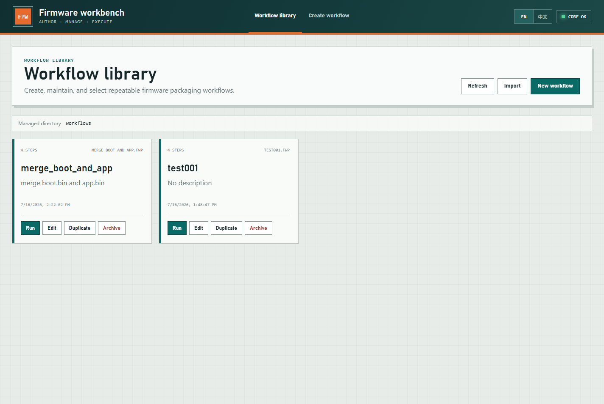
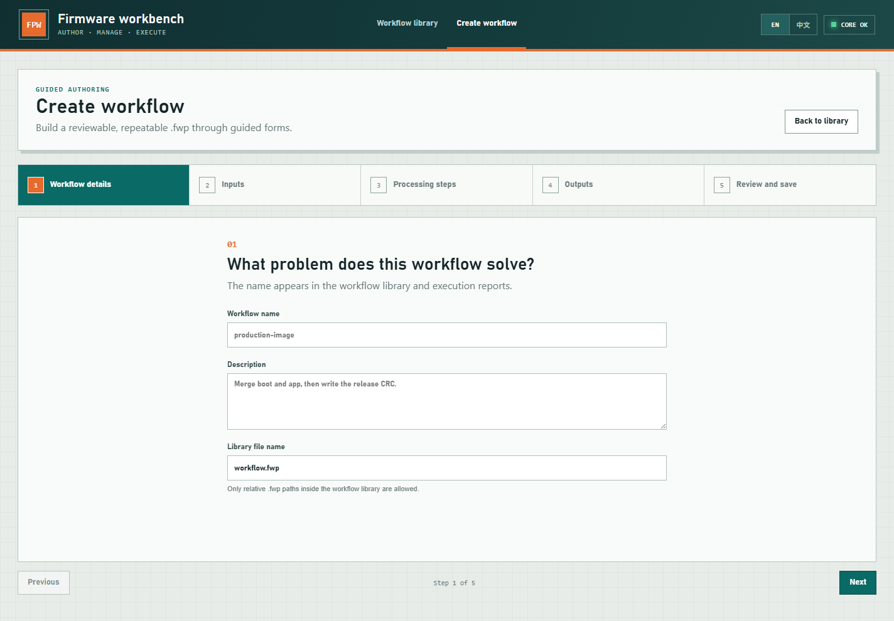
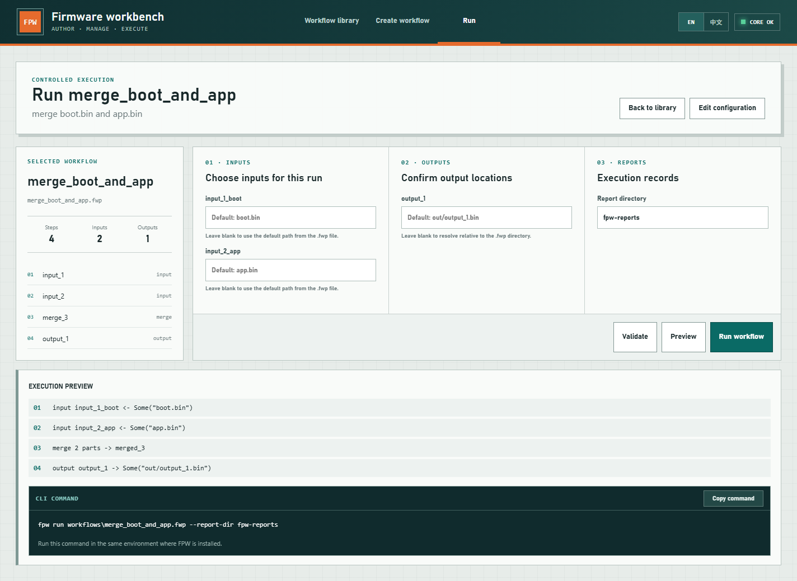

# FPW User Manual

[Project README](README.md) | [中文用户手册](User-Manual-CN.md) | [FWP Schema](docs/fwp-schema-v1.md)

This manual explains how to build FPW on Windows, use its CLI and WebUI, understand path and artifact rules, and create common binary-processing workflows.

Documented release: **v0.0.2**

## 1. Build and Start

### 1.1 Prerequisites

- Windows PowerShell
- Rust toolchain and Cargo
- Node.js and npm

Verify the tools:

```powershell
rustc --version
cargo --version
node --version
npm --version
```

### 1.2 Build the WebUI

```powershell
Set-Location web
npm install
npm run build
Set-Location ..
```

The static assets are generated in `web/dist/`. The `fpw web` command serves these files. If the directory is missing, FPW displays only its built-in fallback page.

### 1.3 Build the CLI

```powershell
cargo build --release -p fpw-cli
```

The release executable is `target\release\fpw.exe`.

## 2. `.fwp` Fundamentals

A `.fwp` file is JSON. Steps run in array order and exchange in-memory binary artifacts by name.

```json
{
  "schemaVersion": 1,
  "name": "copy-image",
  "description": "Read and write a firmware image",
  "steps": [
    {
      "id": "firmware",
      "kind": "input",
      "name": "firmware",
      "path": "input.bin"
    },
    {
      "id": "write_image",
      "kind": "output",
      "input": "firmware",
      "name": "image",
      "path": "out/image.bin"
    }
  ]
}
```

Key concepts:

- `id` uniquely identifies a step.
- `name` identifies an external file path that CLI `--input` or `--output` can override.
- An artifact is an in-memory binary value passed between steps, such as `firmware`, `merged`, or `image`.
- `input`, `base`, and `insert` reference artifacts produced by earlier steps.
- A processing step's `output` names its new artifact. An `output` file step instead uses `input` to select the artifact to write.

Numeric fields accept decimal numbers or hexadecimal strings, such as `128` and `"0x80"`.

## 3. CLI Usage

These examples assume the repository root is the current directory. If FPW is on `PATH`, replace `.\target\release\fpw.exe` with `fpw`.

### 3.1 Create a Starter Workflow

```powershell
.\target\release\fpw.exe config --output workflows\my-workflow.fwp
```

Without `--output`, the CLI prompts for a destination.

### 3.2 Validate

```powershell
.\target\release\fpw.exe validate workflows\my-workflow.fwp
```

Validation checks the schema, step IDs, artifact references, and field values without processing firmware files.

### 3.3 Preview

```powershell
.\target\release\fpw.exe preview examples\merge-insert.fwp
```

Preview prints the ordered execution plan without reading or writing firmware files.

### 3.4 Run

```powershell
.\target\release\fpw.exe run examples\merge-insert.fwp
```

Override named paths and the report directory:

```powershell
.\target\release\fpw.exe run workflows\release.fwp `
  --input boot=C:\images\boot.bin `
  --input app=C:\images\app.bin `
  --output image=C:\images\combined.bin `
  --report-dir C:\images\reports
```

`--input` and `--output` may be repeated. Each `name` must match the corresponding `name` field in an input or output file step.

### 3.5 Recent Projects

```powershell
.\target\release\fpw.exe recent list
.\target\release\fpw.exe recent add workflows\my-workflow.fwp
```

## 4. WebUI Usage

### 4.1 Start the Server

```powershell
.\target\release\fpw.exe web --host 127.0.0.1 --port 4769
```

Open `http://127.0.0.1:4769/`. Keep the terminal running because the browser calls this local FPW process for workflow management and execution.

Stop or restart the registered server from another terminal:

```powershell
.\target\release\fpw.exe web stop
.\target\release\fpw.exe web restart
.\target\release\fpw.exe web restart --host 127.0.0.1 --port 4769
```

FPW records the active WebUI PID, host, port, and version under its local configuration directory. `restart` reuses the recorded address unless overridden. A stale record is removed without terminating an unrelated process.

### 4.2 Workflow Library

The library displays the real `.fwp` files managed under `workflows/` by default.



- **New workflow** opens guided authoring.
- **Run** opens the selected saved configuration.
- **Edit** opens the configuration in the wizard.
- **Duplicate** creates another managed `.fwp` file.
- **Archive** moves a file to `workflows/.trash/`.
- **Import** imports an existing `.fwp` file.

Set a different managed root before starting the server when needed:

```powershell
$env:FPW_WORKFLOW_HOME='C:\fpw-workflows'
.\target\release\fpw.exe web
```

### 4.3 Five-Stage Authoring Wizard



1. Enter workflow metadata and its library filename.
2. Define one or more named input files.
3. Add ordered `fill`, `insert`, `merge`, `crc32`, or `sha256` processing steps.
4. Define output artifact names and default paths.
5. Validate, preview, review JSON when necessary, and save.

### 4.4 Run Preview and CLI Command

Select an existing workflow, optionally enter path overrides, and choose **Preview**.



- **Validate** checks the selected workflow.
- **Preview** displays the ordered execution plan and a copyable CLI command without processing files.
- **Run workflow** calls the same core engine used by the CLI and displays step status and report paths.

The generated command contains the managed workflow's absolute path, non-empty input/output overrides, and report directory. If it begins with `fpw` but FPW is not on `PATH`, replace that token with `.\target\release\fpw.exe`.

## 5. Path Rules

- Relative paths inside `.fwp` are resolved from the `.fwp` file's directory.
- Relative CLI `--input` and `--output` overrides are resolved from the FPW process working directory.
- A relative `--report-dir` is also resolved from the process working directory.
- WebUI paths are accessed by the `fpw web` server process, not by the browser itself.
- Quote Windows paths containing spaces. Run Preview quotes common path arguments automatically.

## 6. Insert Example

`insert` overwrites the base artifact at an offset. It does not shift the original bytes.

```json
{
  "schemaVersion": 1,
  "name": "insert-example",
  "steps": [
    { "id": "base_file", "kind": "input", "name": "base", "path": "base.bin" },
    { "id": "patch_file", "kind": "input", "name": "patch", "path": "patch.bin" },
    {
      "id": "insert_patch",
      "kind": "insert",
      "base": "base",
      "insert": "patch",
      "output": "patched",
      "offset": "0x10"
    },
    { "id": "write_patched", "kind": "output", "input": "patched", "name": "image", "path": "out/patched.bin" }
  ]
}
```

```powershell
.\target\release\fpw.exe run workflows\insert-example.fwp `
  --input base=C:\images\base.bin `
  --input patch=C:\images\patch.bin `
  --output image=C:\images\patched.bin
```

The patch starts at offset `0x10`. Existing bytes are overwritten. A write beyond EOF extends the result, and any gap is filled with `0xFF`.

## 7. Merge Example

`merge` places multiple artifacts at explicit offsets in a new image.

```json
{
  "schemaVersion": 1,
  "name": "merge-example",
  "steps": [
    { "id": "boot_file", "kind": "input", "name": "boot", "path": "boot.bin" },
    { "id": "app_file", "kind": "input", "name": "app", "path": "app.bin" },
    {
      "id": "merge_images",
      "kind": "merge",
      "output": "merged",
      "parts": [
        { "input": "boot", "offset": "0x0" },
        { "input": "app", "offset": "0x1000" }
      ]
    },
    { "id": "write_image", "kind": "output", "input": "merged", "name": "image", "path": "out/merged.bin" }
  ]
}
```

```powershell
.\target\release\fpw.exe preview examples\merge-insert.fwp
.\target\release\fpw.exe run examples\merge-insert.fwp
```

Gaps are filled with `0xFF`. If the actual byte ranges of any two parts overlap, execution fails instead of overwriting data.

## 8. Fill, CRC32, and SHA256 Example

`examples/fill-crc-sha.fwp` demonstrates a complete processing chain:

1. Load the firmware artifact.
2. Fill a selected region with `0xFF`.
3. Calculate IEEE CRC-32 over a selected byte range and write its four bytes back at `writeOffset`.
4. Calculate SHA256 and create a separate 32-byte digest artifact.
5. Write both the modified image and digest.

```powershell
.\target\release\fpw.exe validate examples\fill-crc-sha.fwp
.\target\release\fpw.exe preview examples\fill-crc-sha.fwp
.\target\release\fpw.exe run examples\fill-crc-sha.fwp
```

```json
{
  "id": "write_crc",
  "kind": "crc32",
  "input": "filled",
  "output": "with_crc",
  "range": { "offset": "0x0", "length": 16 },
  "writeOffset": "0x14",
  "endian": "little"
}
```

`range` selects bytes in the current input artifact. `writeOffset` is also relative to that input artifact. Endianness controls the order of the four CRC bytes. The operation creates a new output artifact and does not mutate the earlier artifact.

## 9. Reports and Troubleshooting

By default, each run writes JSON and TXT reports under `fpw-reports/`.

When execution fails, check:

- The workflow path in the command.
- Whether override names exactly match input/output `name` fields.
- Whether each referenced artifact is produced by an earlier step.
- Whether CRC32 or SHA256 ranges exceed the current artifact length.
- Whether merge part ranges overlap.
- Whether the `fpw web` server process can access every configured path.

Developer verification:

```powershell
cargo fmt --all -- --check
cargo test --workspace
cargo clippy --workspace --all-targets -- -D warnings
Set-Location web
npm run build
```

See [docs/fwp-schema-v1.md](docs/fwp-schema-v1.md) for the field-level schema.
