# FPW WebUI：Postbuild MCU Image Package 中文操作向导

本文介绍如何使用 FPW WebUI 中的 **Postbuild templates → MCU image package**，完成与原
`Postbuild/postbuild.py` MCU 主流程对应的固件合并、版本校验、J-Link 文件生成和
`imgAr` release archive 打包。

## 1. 功能范围

MCU Image Package 模板处理三个 Intel HEX 输入：

| FPW 输入名 | 原 Postbuild 临时文件 | 建议选择的工程输出 |
| --- | --- | --- |
| `gboot` | `imgBoot.hex` | `Output/GungnirS_app/gboot/Exe/GungnirS_app.hex` |
| `image_a` | `imgA.hex` | `Output/GungnirS_app/ImageA/Exe/GungnirS_app.hex` |
| `image_b` | `imgB.hex` | `Output/GungnirS_app/ImageB/Exe/GungnirS_app.hex` |

模板依次完成：

1. 从 Gboot 提取 Bank A 的 `0x08000000..0x08001FFF`。
2. 从 Gboot 提取 Bank B 的 `0x08100000..0x08101FFF`。
3. 合并两个 Gboot 区域。
4. 叠加 Image A 和 Image B。
5. 在 `0x0810C000` 写入 `00 00`，默认选择 Image A。
6. 从 `0x08010250` 和 `0x08110250` 分别读取 7 字节固件版本。
7. 检查 Image A 与 Image B 版本一致。
8. 调用 `tools/imgAr.exe`，依次追加 `IMG-A` 和 `IMG-B`。
9. 输出 MCU release archive、J-Link HEX 和 J-Link BIN。

## 2. 启动 WebUI

在 FPW 安装目录打开 PowerShell：

```powershell
.\fpw.exe web
```

浏览器访问：

```text
http://127.0.0.1:4769/
```

页面右上角显示 `CORE OK` 才表示 WebUI 已连接核心执行引擎。

## 3. 选择 MCU 模板

在 **Workflow library** 页面找到 **Postbuild templates**，点击
**MCU image package**。

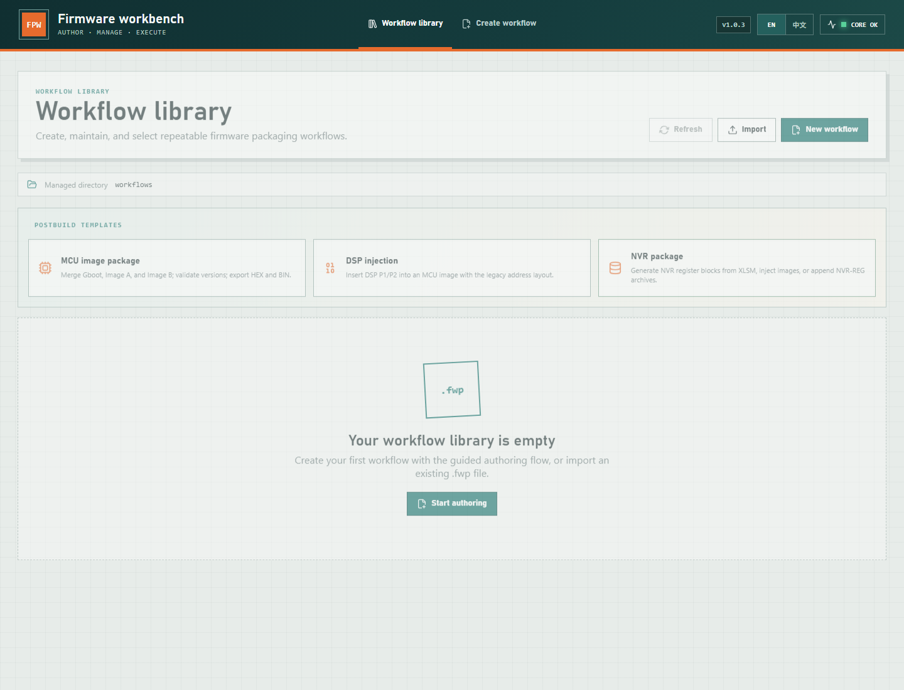

三个模板的用途：

- **MCU image package**：Gboot、Image A、Image B 合并及 MCU archive 打包。
- **DSP injection**：DSP 写入 MCU 镜像，并向已有 archive 追加 DSP。
- **NVR package**：生成 NVR、写入 MCU 镜像或追加到 archive。

本文只讲 MCU Image Package。

## 4. 第一步：基本信息

模板打开后进入五步式创建向导。

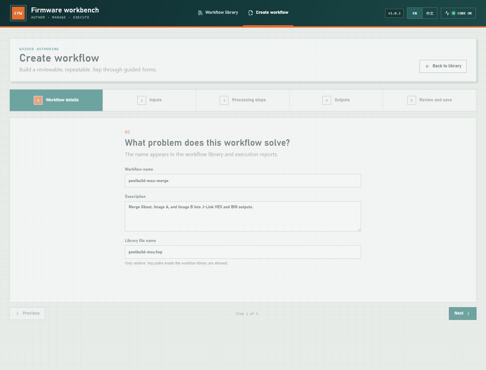

建议设置：

| 字段 | 建议值 | 说明 |
| --- | --- | --- |
| Workflow name | `postbuild-mcu-package` | WebUI Library 和执行报告中显示的名称 |
| Description | 保留模板说明或写入项目说明 | 不影响执行 |
| Library file name | `postbuild-mcu-package.fwp` | 保存到 FPW 的 `workflows` 目录 |

点击 **Next**。

## 5. 第二步：确认三个输入

模板已经创建三个 `image-input`：

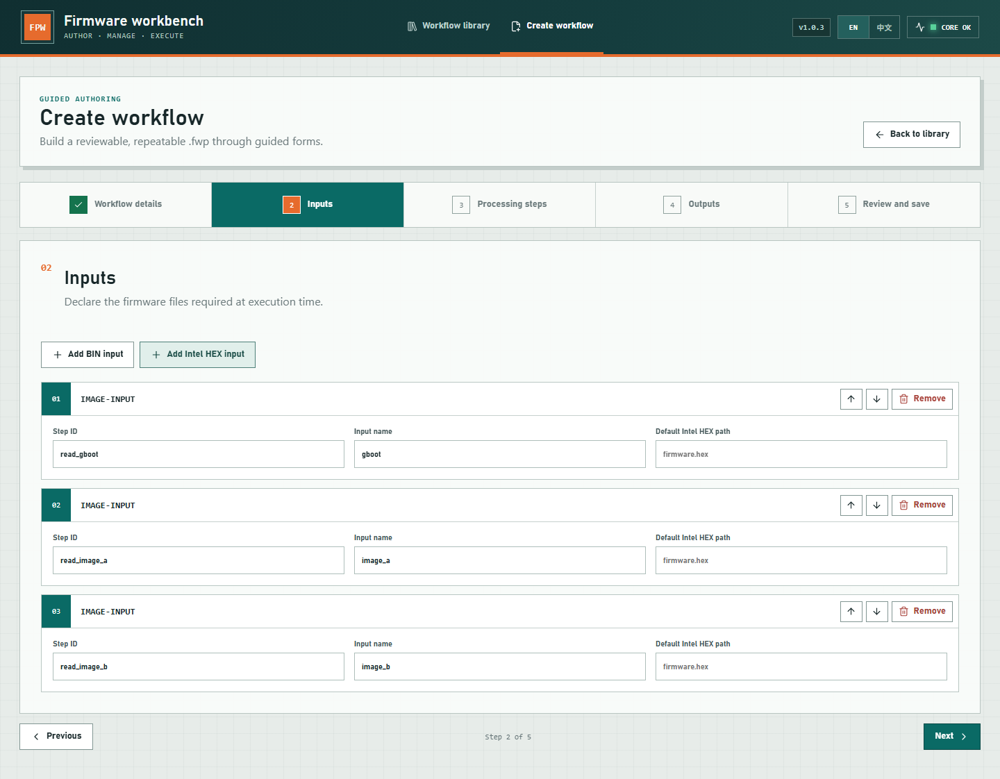

| Step ID | Input name | 运行时应选择 |
| --- | --- | --- |
| `read_gboot` | `gboot` | Gboot Intel HEX |
| `read_image_a` | `image_a` | Image A Intel HEX |
| `read_image_b` | `image_b` | Image B Intel HEX |

### Default Intel HEX path 如何使用

- 留空或保留占位路径时，运行阶段通过文件选择器指定真实文件。
- 填写相对路径时，相对于 `.fwp` 工作流文件所在目录解析。
- WebUI 运行页面中重新选择输入，会覆盖这里的默认路径。

为避免工作流绑定某个开发者的绝对路径，推荐在模板中不写绝对路径，在每次运行时选择输入。

## 6. 第三步：检查处理步骤

模板已经建立完整处理链，不需要手工添加步骤。

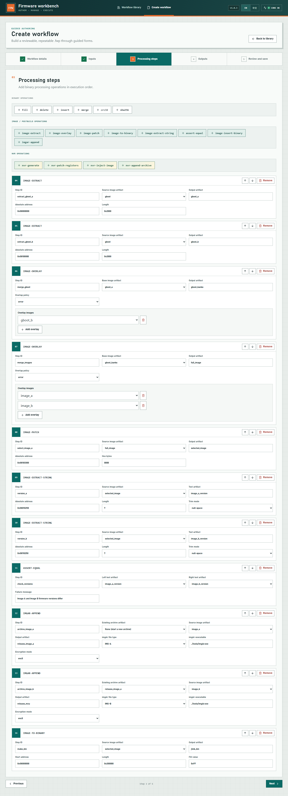

### 镜像处理步骤

| Step ID | 操作 | 作用 |
| --- | --- | --- |
| `extract_gboot_a` | `image-extract` | 提取 Bank A Gboot，地址 `0x08000000`，长度 `0x2000` |
| `extract_gboot_b` | `image-extract` | 提取 Bank B Gboot，地址 `0x08100000`，长度 `0x2000` |
| `merge_gboot` | `image-overlay` | 将 Bank B Gboot 叠加到 Bank A Gboot |
| `merge_images` | `image-overlay` | 将 Image A、Image B 叠加到双 bank Gboot |
| `select_image_a` | `image-patch` | 在 `0x0810C000` 写入 `0000`，默认提交 Image A |
| `version_a` | `image-extract-string` | 从 `0x08010250` 提取 Image A 的 7 字节版本 |
| `version_b` | `image-extract-string` | 从 `0x08110250` 提取 Image B 的 7 字节版本 |
| `check_versions` | `assert-equal` | A/B 版本不一致时终止打包 |

模板的 overlap policy 使用 `error`。正常的 Gboot、Image A、Image B 地址区间不应冲突；
如果发生意外重叠，FPW 会直接报错，而不是像原 Python 脚本的 `overlap='replace'` 那样静默覆盖。
这是有意保留的安全检查。

### imgAr release archive 步骤

| Step ID | Archive 输入 | 镜像输入 | File type | 输出 |
| --- | --- | --- | --- | --- |
| `archive_image_a` | 空，创建新 archive | `image_a` | `IMG-A` | `release_image_a` |
| `archive_image_b` | `release_image_a` | `image_b` | `IMG-B` | `release_mcu` |

两个步骤的关键字段：

- **imgAr executable**：`../tools/imgAr.exe`
- **Encryption mode**：默认 `enc0`
- **Existing archive artifact**：第一步必须为空；第二步必须选择第一步的输出
- **Source image artifact**：分别选择 `image_a`、`image_b`

这与原 Postbuild 的下列调用顺序一致：

```text
imgAr.exe <archive> enc0 IMG-A <date> <time> imgA.hex
imgAr.exe <archive> enc0 IMG-B <date> <time> imgB.hex
```

### 需要生成 enc1 加密包时

原 Postbuild 可根据 `encrypt_included` 同时生成 `enc1` 包。默认 FPW MCU 模板只生成
`enc0`，需要加密包时：

1. 再添加两个 `imgar-append` 步骤。
2. 第一个步骤不选择 Existing archive，输入 `image_a`，类型 `IMG-A`，Encryption mode 设为 `enc1`。
3. 第二个步骤以上一步输出为 Existing archive，输入 `image_b`，类型 `IMG-B`，Encryption mode 设为 `enc1`。
4. 增加一个 BIN output，将最终 artifact 写为 `release-mcu-enc.bin`。

不要把 `enc0` 的 archive 作为 `enc1` 链的起点。

## 7. 第四步：确认输出

模板默认建立三个输出：

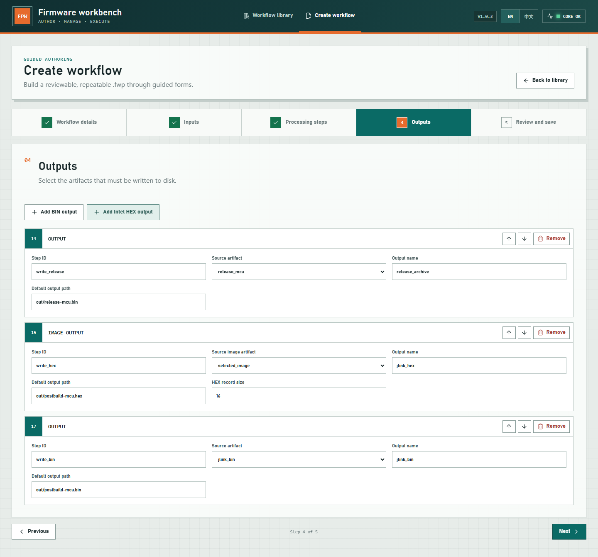

| Output name | 默认路径 | 内容 |
| --- | --- | --- |
| `release_archive` | `out/release-mcu.bin` | 包含 IMG-A、IMG-B 的 imgAr release archive |
| `jlink_hex` | `out/postbuild-mcu.hex` | 合并后的 Intel HEX |
| `jlink_bin` | `out/postbuild-mcu.bin` | `0x08000000` 起始、长度 `0x200000`、空洞填 `0xFF` 的 BIN |

默认输出路径相对于 `.fwp` 所在目录。运行页面重新选择输出位置时，以运行页面设置为准。

FPW 使用稳定的通用文件名；原 Postbuild 会将固件版本拼入文件名。需要完全沿用旧命名规范时，
可以在运行页面把输出位置改为例如：

```text
release_GungnirS_22370580_001_000_v1_2_3_wodsp.bin
forJlink_GungnirS_Img_v1_2_3.hex
forJlink_GungnirS_Img_v1_2_3.bin
```

## 8. 第五步：校验并保存

进入 **Review and save** 后，先检查工作流名称和操作按钮：

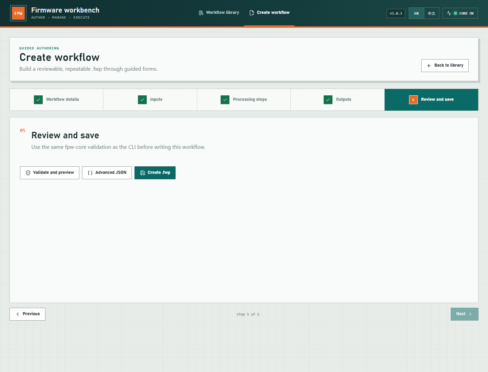

点击 **Validate and preview**。

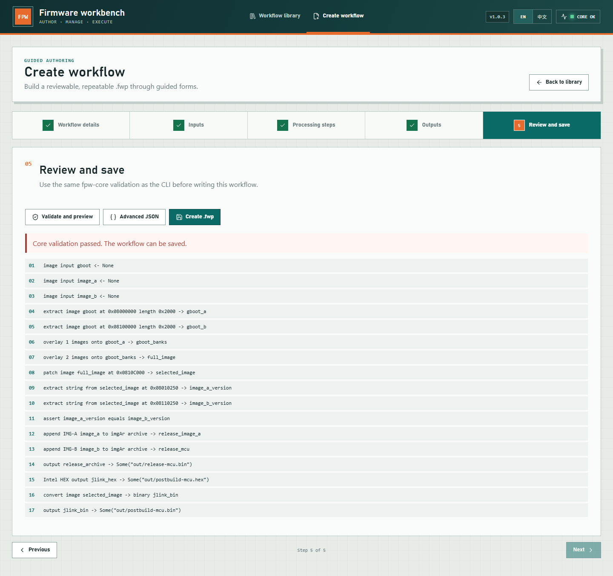

确认：

- 页面显示 `Core validation passed`。
- 第 12 步为 `append IMG-A image_a`。
- 第 13 步为 `append IMG-B image_b`。
- 第 14、15、17 步分别写出 release archive、J-Link HEX、J-Link BIN。

然后点击 **Create .fwp**。工作流会进入 Workflow Library，可重复编辑和运行。

## 9. 在 WebUI 中执行

1. 回到 **Workflow library**。
2. 找到刚保存的 `postbuild-mcu-package`。
3. 点击 **Run**。
4. 在 **Choose inputs for this run** 中分别选择 `gboot`、`image_a`、`image_b`。
5. 在 **Confirm output locations** 中确认三个输出路径。
6. 先点击 **Validate**。
7. 点击 **Preview**，检查 Execution preview 和 COMMAND。
8. 点击 **Run workflow**。

成功时应看到：

- `status: success`
- `release_archive` 已写出
- `jlink_hex` 已写出
- `jlink_bin` 已写出
- JSON 和文本执行报告已生成

## 10. 使用同一工作流从 CLI 执行

WebUI Preview 页面会显示完整 COMMAND。等价命令示例：

```powershell
.\fpw.exe run workflows\postbuild-mcu-package.fwp `
  --input gboot="D:\firmware\gboot\GungnirS_app.hex" `
  --input image_a="D:\firmware\ImageA\GungnirS_app.hex" `
  --input image_b="D:\firmware\ImageB\GungnirS_app.hex" `
  --output release_archive="D:\release\release-mcu.bin" `
  --output jlink_hex="D:\release\postbuild-mcu.hex" `
  --output jlink_bin="D:\release\postbuild-mcu.bin" `
  --report-dir="D:\release\reports"
```

先校验或预览：

```powershell
.\fpw.exe validate workflows\postbuild-mcu-package.fwp
.\fpw.exe preview workflows\postbuild-mcu-package.fwp
```

`validate` 只校验工作流结构；只有 `run` 阶段才读取实际输入并执行 A/B 版本比较。

## 11. 与原 Postbuild 的对应关系

| 原 Postbuild 行为 | FPW MCU Image Package |
| --- | --- |
| 复制三个工程 HEX 为临时文件 | 运行时选择三个 HEX，不再复制固定文件名 |
| IntelHex 提取两个 Gboot 区域 | 两个 `image-extract` |
| `merge(..., overlap='replace')` | `image-overlay`，默认冲突时报错 |
| 写 `BOOT_CTRL_BLK_IMGA` | `image-patch` 写 `0x0810C000 = 0000` |
| 读取并比较 Image A/B 版本 | 两个 `image-extract-string` + `assert-equal` |
| 输出 J-Link HEX/BIN | `image-output` + `image-to-binary` + `output` |
| imgAr 追加 IMG-A、IMG-B | 两个串联的 `imgar-append` |
| 根据配置生成 enc0/enc1 | 模板默认 enc0；enc1 可增加独立 archive 链 |
| 文件名自动拼接版本 | FPW 在输出配置中明确指定文件名 |
| 清理脚本临时文件 | FPW 自动清理每个 imgAr 步骤的临时目录 |

## 12. 常见问题

### A/B 固件版本不一致

错误来自 `check_versions`。确认：

- `image_a` 没有误选成 Image B。
- 两个工程输出来自同一次发布构建。
- 地址 `0x08010250`、`0x08110250` 仍符合当前 MCU memory map。

### 找不到 imgAr.exe

确认 FPW 目录包含：

```text
FPW-v1.0.3/
  fpw.exe
  tools/
    imgAr.exe
```

工作流位于 `workflows` 目录时，工具路径应为 `../tools/imgAr.exe`。

### Intel HEX 地址重叠

FPW 默认拒绝未预期的重叠。不要直接把 overlap policy 改为 `replace` 来绕过错误，应先确认：

- 三个 HEX 是否来自正确构建目标。
- Image A/B 的链接地址是否正确。
- Gboot 是否包含了模板未考虑的新地址范围。

### 输出目录不存在

FPW 会创建输出文件的父目录。若仍失败，检查目标目录写权限以及文件是否被其他程序占用。

### release archive 能否继续追加 DSP/NVR

可以。详细操作见下一章。需要注意：

- DSP 模板已经内置 `DSP-N-A` archive 追加步骤。
- NVR 模板默认只生成 NVR 数据，需要手工增加 `release_archive` 输入、
  `nvr-append-archive` 和最终输出。

## 13. 在 MCU release archive 后追加 DSP

### 13.1 输入文件

先完成 MCU Image Package，得到：

```text
release-mcu.bin
postbuild-mcu.hex
postbuild-mcu.bin
```

然后回到 Workflow Library，点击 **DSP injection** 模板。

DSP 模板需要三个输入：

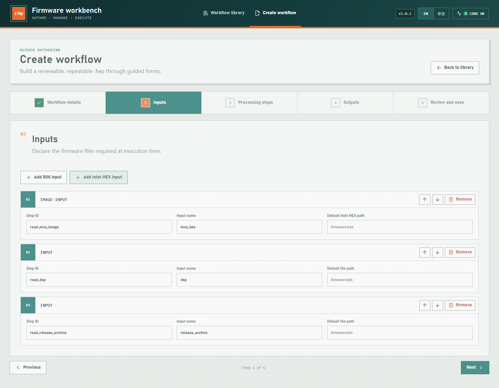

| Input name | 选择文件 | 用途 |
| --- | --- | --- |
| `mcu_hex` | MCU 模板生成的 `postbuild-mcu.hex` | 生成包含 DSP 的 J-Link HEX/BIN |
| `dsp` | DSP 原始 BIN | 写入 MCU image，同时作为 `DSP-N-A` archive 数据 |
| `release_archive` | MCU 模板生成的 `release-mcu.bin` | 已包含 `IMG-A`、`IMG-B` 的 archive |

这里的 `release_archive` 不是 J-Link BIN，不能误选 `postbuild-mcu.bin`。

### 13.2 DSP 注入与 archive 追加

模板已经配置以下步骤：

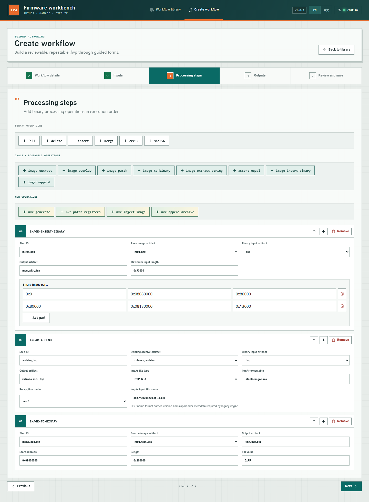

#### `inject_dsp`

DSP 被分为两个区域写入 MCU image：

| DSP 源偏移 | MCU 绝对地址 | 长度 |
| --- | --- | --- |
| `0x00000` | `0x08080000` | `0x80000` |
| `0x80000` | `0x08180000` | `0x13000` |

DSP 最大长度为 `0x93000` 字节。超过此长度时 FPW 会拒绝执行。

#### `archive_dsp`

| 字段 | 模板值 | 含义 |
| --- | --- | --- |
| Existing archive artifact | `release_archive` | MCU 阶段产生的 archive |
| Binary input artifact | `dsp` | 要追加的 DSP BIN |
| Output artifact | `release_mcu_dsp` | 包含 MCU 和 DSP 的新 archive |
| imgAr file type | `DSP-N-A` | 与原 Postbuild 当前启用的 DSP 类型一致 |
| imgAr executable | `../tools/imgAr.exe` | FPW 发布包中的 imgAr |
| Encryption mode | `enc0` | 必须与 MCU archive 的加密模式一致 |
| imgAr input file name | `dsp_vE000F200_ig1_A.bin` | 传给旧 imgAr 的逻辑文件名 |

`imgAr input file name` 不是任意描述字符串，它承载 DSP 版本和 skip-header 信息，格式必须类似：

```text
dsp_vE000F200_ig1_A.bin
```

- `E000F200`：8 位十六进制 DSP 版本。
- `ig1`：跳过 DSP header。
- `ig0`：不跳过 DSP header。
- `_A`：Image A DSP。

原 Postbuild 中 `DSP-N-B` 调用处于注释状态，因此模板默认只追加 `DSP-N-A`。

### 13.3 DSP 输出

模板默认输出：

| Output name | 默认路径 | 内容 |
| --- | --- | --- |
| `release_archive` | `out/release-mcu-dsp.bin` | IMG-A + IMG-B + DSP-N-A |
| `jlink_dsp_hex` | `out/postbuild-mcu-dsp.hex` | 注入 DSP 的 J-Link HEX |
| `jlink_dsp_bin` | `out/postbuild-mcu-dsp.bin` | 注入 DSP 的 J-Link BIN |

在 Review and save 页面点击 **Validate and preview**，预览应包含
`append DSP-N-A dsp to imgAr archive`：

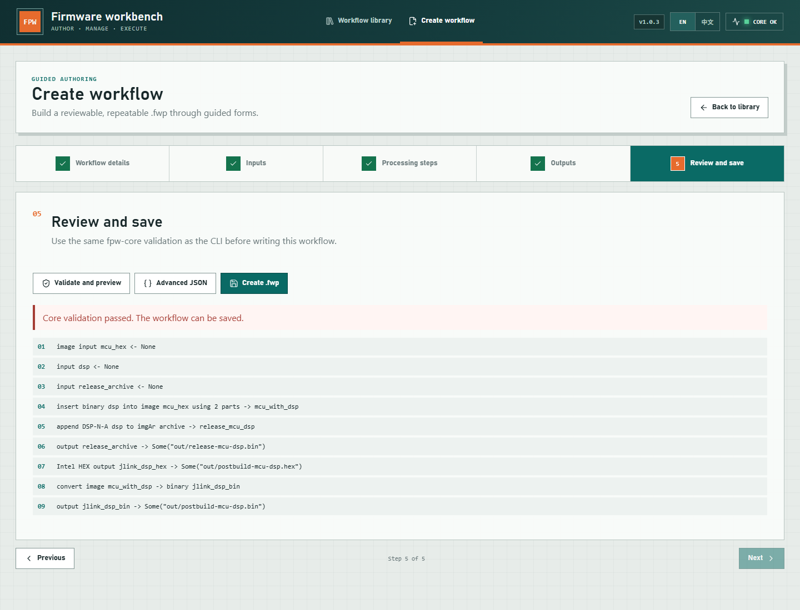

保存工作流后，在 Run 页面选择三个输入并执行。DSP 阶段的 archive 数据流为：

```text
release-mcu.bin
  + dsp_vE000F200_ig1_A.bin
  → release-mcu-dsp.bin
```

### 13.4 DSP CLI 示例

```powershell
.\fpw.exe run workflows\postbuild-dsp-inject.fwp `
  --input mcu_hex="D:\release\postbuild-mcu.hex" `
  --input dsp="D:\dsp\dsp_vE000F200.bin" `
  --input release_archive="D:\release\release-mcu.bin" `
  --output release_archive="D:\release\release-mcu-dsp.bin" `
  --output jlink_dsp_hex="D:\release\postbuild-mcu-dsp.hex" `
  --output jlink_dsp_bin="D:\release\postbuild-mcu-dsp.bin" `
  --report-dir="D:\release\reports"
```

## 14. 在 release archive 后追加 NVR

NVR 可以直接追加在 MCU archive 后，也可以追加在 MCU + DSP archive 后。为了与原
Postbuild 的最终 release archive 顺序保持一致，推荐使用：

```text
IMG-A → IMG-B → DSP-N-A → NVR-REG
```

### 14.1 创建 NVR 数据

点击 **NVR package** 模板，进入 Processing steps：

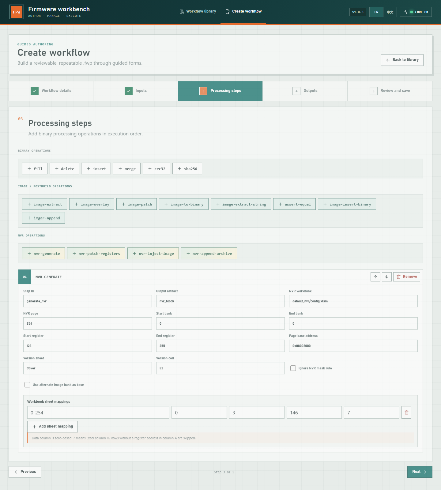

默认 `generate_nvr` 的关键配置：

| 字段 | 模板值 | 含义 |
| --- | --- | --- |
| NVR workbook | `default_nvr/config.xlsm` | NVR 配置工作簿 |
| NVR page | `254` | 目标 NVR page |
| Start bank / End bank | `0 / 0` | 生成 Bank 0 |
| Start register / End register | `128 / 255` | 每个 bank 的 128 字节寄存器区间 |
| Page base address | `0x08002000` | 写入 image 时使用的 MCU 地址 |
| Version sheet / cell | `Cover / E3` | NVR 版本来源 |
| Sheet mapping | `0_254, bank 0, rows 3..146, column 7` | Excel 数据映射 |

Data column 使用从零开始的列编号，`7` 表示 Excel H 列。A 列没有寄存器地址的行会跳过。

默认模板预览只包含：

1. `generate_nvr`
2. 将 `nvr_block` 输出为 `out/nvr.bin`

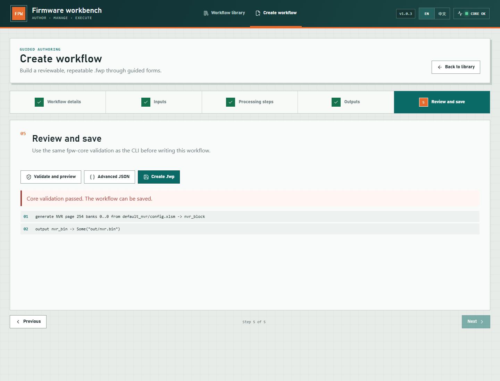

此时还没有把 NVR 加入 release archive。

### 14.2 增加已有 archive 输入

回到向导的 **Inputs**：

1. 点击 **Add BIN input**。
2. Step ID 改为 `read_release_archive`。
3. Input name 改为 `release_archive`。
4. 默认路径可以留空，在 Run 页面选择：
   - 有 DSP 时选择 `release-mcu-dsp.bin`；
   - 无 DSP 时选择 `release-mcu.bin`。

### 14.3 添加 `nvr-append-archive`

进入 **Processing steps**，在 **NVR operations** 区域点击
**nvr-append-archive**。该按钮位于上图 NVR 操作区最右侧。

设置：

| 字段 | 设置值 |
| --- | --- |
| Step ID | `archive_nvr` |
| Existing archive artifact | `release_archive` |
| NVR artifact | `nvr_block` |
| Output artifact | `release_mcu_dsp_nvr` |
| imgAr executable | `../tools/imgAr.exe` |
| Encryption mode | `enc0` |

执行时 FPW 会：

1. 复制已有 archive，避免修改输入文件。
2. 将 `nvr_block` 写为 imgAr 临时输入。
3. 调用 imgAr，以 `NVR-REG` 类型追加数据。
4. 生成新的 Binary artifact `release_mcu_dsp_nvr`。
5. 自动清理临时目录。

如果已有 archive 是 `enc1`，这里也必须选择 `enc1`。不要把 `enc0` 与 `enc1` 条目混入同一个
archive。

### 14.4 增加最终 archive 输出

进入 **Outputs**：

1. 点击 **Add BIN output**。
2. Step ID 改为 `write_release_nvr`。
3. Source artifact 选择 `release_mcu_dsp_nvr`。
4. Output name 设置为 `release_archive`。
5. Default output path 设置为 `out/release-mcu-dsp-nvr.bin`。

保存前点击 **Validate and preview**，确认预览中顺序为：

```text
generate NVR ...
append NVR ... to archive release_archive
output release_archive ...
```

### 14.5 NVR archive CLI 示例

仓库提供了独立示例：

```text
examples/postbuild-nvr-archive.fwp
```

执行方式：

```powershell
.\fpw.exe run examples\postbuild-nvr-archive.fwp `
  --input archive="D:\release\release-mcu-dsp.bin" `
  --output release_archive="D:\release\release-mcu-dsp-nvr.bin" `
  --report-dir="D:\release\reports"
```

示例会从 XLSM 生成 NVR，再以 `NVR-REG` 追加到输入 archive。

## 15. 完整 release archive 推荐流程

### 15.1 WebUI 分阶段操作

| 阶段 | 使用模板/工作流 | 主要输入 | archive 输出 |
| --- | --- | --- | --- |
| 1 | MCU image package | Gboot、Image A、Image B | `release-mcu.bin` |
| 2 | DSP injection | MCU HEX、DSP、`release-mcu.bin` | `release-mcu-dsp.bin` |
| 3 | NVR package + `nvr-append-archive` | XLSM、`release-mcu-dsp.bin` | `release-mcu-dsp-nvr.bin` |

每一阶段都使用上一阶段的 archive 输出作为下一阶段的 Existing archive 输入：

```text
Image A + Image B
        │
        ▼
release-mcu.bin
        │ + DSP-N-A
        ▼
release-mcu-dsp.bin
        │ + NVR-REG
        ▼
release-mcu-dsp-nvr.bin
```

### 15.2 最终 archive 内容

按推荐顺序，最终文件包含：

```text
Entry 1: IMG-A
Entry 2: IMG-B
Entry 3: DSP-N-A
Entry 4+: NVR-REG
```

NVR 配置可能生成多个 NVR binary block。每个 block 都会作为独立的 `NVR-REG` 条目依次追加，
与原 Postbuild 遍历 `nvr_bin_list` 的行为一致。

### 15.3 关键一致性规则

- MCU、DSP、NVR 三个阶段必须使用相同 encryption mode。
- DSP BIN 长度不能超过 `0x93000`。
- DSP 的 imgAr input file name 必须符合版本命名格式。
- NVR 每个 bank 必须生成 128 字节寄存器数据。
- 不要把 J-Link BIN 当作 release archive。
- 不要覆盖上一阶段输入，始终输出一个新的 archive 文件，便于追踪和回退。

### 15.4 当前版本实测结果

使用 FPW v1.0.3 和随项目提供的工作流进行链式测试：

| 文件 | 大小 |
| --- | ---: |
| MCU IMG-A + IMG-B archive | `868864` 字节 |
| 追加 DSP-N-A 后 | `1471232` 字节 |
| 再追加 Bank 0 NVR-REG 后 | `1471744` 字节 |

NVR 阶段增加 `512` 字节，其中包含 256 字节 NVR 数据及 imgAr archive 条目头。三个阶段均执行成功。
